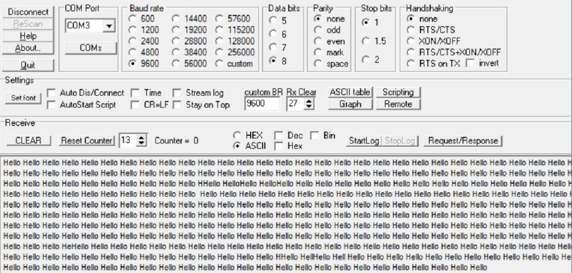

:figure-caption: Рисунок
:table-caption: Таблица
:toc:
:toc-title: ОГЛАВЛЕНИЕ:

== Задание
1. Описать проделанную работу с прерываниями
2. Вывод по интерфейсу UART по прерыванию таймера

== Введение (Прерывания)
Прерывание таймера позволяет:  

* выйти из любого выполняемого на данный момент участка кода в основном цикле;

* выполнить нужный блок кода, который находится внутри прерывания -> вернуться туда, откуда вышли -> продолжить выполнение.

Прерывания могут быть:

1. Асинхронные - могут происходить в любой момент времени.
2. Синхронные - выполняются в определенный момент при выполнении какого-либо условия, например прерывание по ошибки на ноль.
3. Программные - инициализируются с помощью специальной команды.
4. Маскируемые - могут запрещаться или разрешаться.
5. Немаскируемые - не могут запрещаться.

Приоритеты могут быть: 

* относительными - при поступлении во время обработки прерывания прерывание высшего приоритета выполняется после завершения предыдущего;

* абсолютными - при поступлении во время обработки прерывания прерывание высшего приоритета выполняется сразу.

Управление и обработка прерываниями производится контроллером приоритетных векторов прерываний NVIC.

== Описание интерфейса UART

UART означает универсальный асинхронный приёмопередатчик и определяет протокол или набор правил для обмена последовательными данными между двумя устройствами.

UART - протокол, в котором используется только два провода между передатчиком и приемником для передачи и приема в обоих направлениях. Оба конца также имеют заземление. 

Связь в UART может быть: 

* симплексной - данные передаются только в одном направлении;

* полудуплексной - каждая сторона осуществляет передачу, но только по очереди;

* полнодуплексной - обе стороны могут передавать одновременно). 

Данные в UART передаются в виде кадров.

== Работа с программой

В таблицу векторов прерывания добавить 38 строку с вызовом прерывания USART.
[source, c++]
  InterruptHandler::Usart2Handler,        //Usart2Handler

Описываем функцию прерывания USART
[source, c++]
 static void Usart2Handler()
    {
      if (USART2::SR::TXE::Value1::IsSet())
      {
        MessageTransmitter::OnByteTransmit();
      }
    }

== MessageTransmitter.cpp

[source, c++]
#include "messagetransmitter.h"
#include "usart2registers.hpp" //for USART2
void MessageTransmitter::Send(const std::string& message)
{
if(MesTransmit)
{
MesTransmit= false;
std::copy_n(message.begin(),message.size(),buffer.begin());
ByteCounter = 0;
MessageLeight=message.size();
USART2::DR::Write(buffer[ByteCounter]);
ByteCounter++;
  USART2::CR1::TE::Value1::Set();
  USART2::CR1::TXEIE::Value1::Set();
  }
}
void MessageTransmitter::OnByteTransmit()
{
  if(ByteCounter<= MessageLeight)
  {
  USART2::DR::Write(buffer[ByteCounter]) 
  ByteCounter++;
}
else
{
MesTransmit= true;
USART2::CR1::TE::Value0::Set();
USART2::CR1::TXEIE::Value0::Set();
}
}

== main.cpp
[source, c++]
#include "gpiocregisters.hpp" //for Gpioc
#include "gpioaregisters.hpp" //for Gpioa
#include "rccregisters.hpp"   //for RCC
#include "tim2registers.hpp"   //for SPI2
#include "nvicregisters.hpp"  //for NVIC
#include "tim3registers.hpp"   //for SPI2
#include "usart2registers.hpp"  //for TIM3
#include <string>
#include <messagetransmitter.h>
using namespace std ;
constexpr auto SystemClock = 8'000'000U;
constexpr auto TimerClock = 1'000U;
constexpr auto TimerPrescaller =SystemClock/TimerClock;
//constexpr auto Time = 0.5U;
//constexpr auto Delay = 5000'000;
extern "C"
{
int __low_level_init(void)
{
//Switch on internal 8 MHz oscillator
RCC::CR::HSEON::On::Set() ;
while (!RCC::CR::HSERDY::Ready::IsSet())
{
}
//Switch system clock on external oscillator
RCC::CFGR::SW::Hse::Set() ;
while (!RCC::CFGR::SWS::Hse::IsSet())
{
}
RCC::AHB1ENR::GPIOAEN::Enable::Set();
RCC::AHB1ENR::GPIOCEN::Enable::Set(); 
GPIOC::MODER::MODER8::Output::Set();  
GPIOC::MODER::MODER5::Output::Set();
//   GPIOC::MODER::MODER9::Output::Set();
//   GPIOA::MODER::MODER5::Output::Set(); 
RCC::AHB1ENR::GPIOAEN::Enable::Set();
// Настройка на альтернативный режим
GPIOA::MODER::MODER2::Alternate::Set();
GPIOA::MODER::MODER3::Alternate::Set();
GPIOA::AFRL::AFRL2::Af7::Set(); 
GPIOA::AFRL::AFRL3::Af7::Set(); 
// настройка таймера
RCC::APB1ENR::TIM2EN::Enable::Set(); 
TIM2::PSC::Write(TimerPrescaller);
TIM2::ARR::Write(1000);
TIM2::CNT::Write(0);
NVIC::ISER0::Write(1<<28U); 
TIM2::DIER::UIE::Enable::Set();
TIM2::CR1::CEN::Enable::Set(); 
RCC::APB1ENR::TIM3EN::Enable::Set();
TIM3::PSC::Write(TimerPrescaller); 
TIM3::ARR::Write(500);
TIM3::CNT::Write(0); 
NVIC::ISER0::Write(1<<29U); 
TIM3::DIER::UIE::Enable::Set(); 
TIM3::CR1::CEN::Value1::Set();
RCC::APB1ENR::USART2EN::Enable::Set();
USART2::CR1::OVER8::Value1::Set();
USART2::CR1::M::Value1::Set();
USART2::CR1::PCE::Value0::Set();
USART2::BRR::Write(16'000'000/(9600));
USART2::CR1::UE::Value1::Set();
NVIC::ISER1::Write(1<<6U);
return 1;
}
}
int main()
{
std::string testmes="Hello ";
MessageTransmitter::Send(testmes);
for(;;)
{
MessageTransmitter::Send(testmes);
}
return 0 ;
}

== Результат

